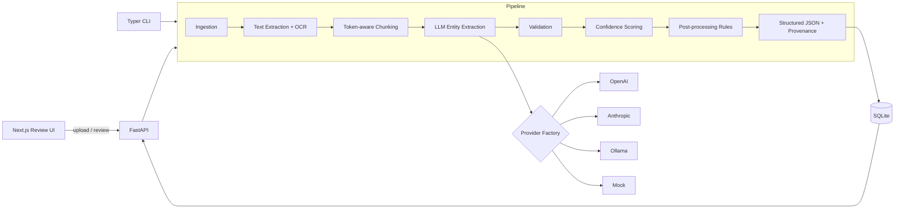

# Architecture

## Pipeline overview



## Module responsibilities

| Module | Responsibility |
| ------ | -------------- |
| `app/core/ingestion.py` | Persist an uploaded file under a unique id, detect its kind from the extension. |
| `app/core/text_extraction.py` | Per-page text via pdfplumber (native), Tesseract OCR fallback, python-docx, plain text. Tracks the extraction `method` per page. |
| `app/core/chunking.py` | Token-aware (tiktoken), page-aware packing with overlap so each LLM call stays under a token budget while keeping page provenance. |
| `app/schemas/` | Declarative `DocSchema`/`FieldSpec` model, built-in types (invoice/resume/contract), `generic` bring-your-own-schema helpers, and the registry. |
| `app/core/prompts.py` | Turns a `DocSchema` into a strict extraction prompt whose output contract is `{fields: {name: {value, confidence, source_text}}}`. |
| `app/core/llm/` | Provider-agnostic interface + OpenAI/Anthropic/Ollama/mock implementations and a factory that reads settings. |
| `app/core/extract.py` | Orchestrates chunk -> LLM -> merged fields. Scalars keep the highest-confidence answer; lists are unioned across chunks. |
| `app/core/postprocess.py` | Type-driven normalization: ISO dates, numeric currency, digit phones, lowercased emails, tidy whitespace. |
| `app/core/validation.py` | Type/format/regex/enum/required checks producing per-field issues (error/warning). |
| `app/core/confidence.py` | Blends model confidence, a source-in-document heuristic, and validation penalties; flags `needs_review`. |
| `app/workflows/pipeline.py` | The end-to-end pipeline producing the final structured JSON (clean `data` + rich `fields`). |
| `app/workflows/service.py` | Bridges the pipeline with persistence; shared by API and CLI. |
| `app/models/db.py` | SQLAlchemy models: `Document`, `ExtractionRun`, `FieldResult`, `Correction`. |
| `app/api/routes/` | REST endpoints for documents, extractions (+corrections/export), and schemas. |

## Output contract

Every extraction run returns:

```jsonc
{
  "doc_type": "invoice",
  "meta": { "pages": 1, "chunks": 1, "used_ocr": false, "provider": "mock", "model": "..." },
  "fields": {
    "invoice_number": {
      "value": "INV-2024-0091",
      "type": "string",
      "many": false,
      "confidence": 0.85,
      "needs_review": false,
      "page": 1,
      "source_text": "INV-2024-0091",
      "issues": []
    }
    // ... one entry per schema field
  },
  "data": { "invoice_number": "INV-2024-0091" /* clean values only */ },
  "review": { "overall_confidence": 0.85, "needs_review_fields": [], "review_threshold": 0.6 }
}
```

- `data` is the clean, application-ready mapping (values only).
- `fields` adds confidence, provenance (page + source snippet), and validation issues for the review UI.

## Extending the system

- **New document type**: add a `DocSchema` (a list of `FieldSpec`s) and register it in `app/schemas/registry.py`, or `POST /schemas` at runtime.
- **Ad-hoc schema**: send `custom_fields` or a JSON Schema in the `POST /extractions` body for one-off `generic` extraction.
- **New provider**: implement `LLMProvider.generate_structured` and wire it into `app/core/llm/factory.py`.

## Reliability notes

- The mock provider makes the whole pipeline runnable offline and deterministic, which is what the test suite exercises.
- Chunk-level failures are captured in `meta.errors` instead of aborting the run.
- The source-text heuristic in confidence scoring guards against hallucinated values that don't appear in the document.
